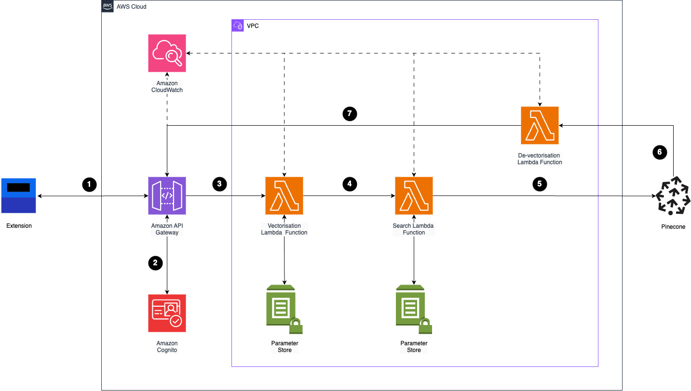

# Pocketstox

Pocketstox is a SaaS product enabling users to perform semantic similarity searches between news articles and earnings transcripts using vector embeddings. The central aim behind this idea is to democratise financial analysis, specifically stock discovery, for retail investors by leveraging natural language processing.

## Links

- [Landing Page](https://www.pocketstox.com/)
- [Extension](https://www.pocketstox.com/) (Currently Unavailable)
- [Code](https://github.com/avolosyanko/pocketstox/tree/main/Extension)

## Ideation

### Problem

The stock discovery process prevents many retail investors from actively investing in the market. The time and effort required leads them to settle for trending companies or passive investments.

### Current Landscape

The stock market's steep learning curve often pushes young professionals toward passive investments like S&P 500 ETFs, sacrificing potential returns for safety and simplicity. Yet these investors are uniquely positioned to pursue active investing – their decades-long investment horizon allows them to take calculated risks, learn from market cycles, and potentially achieve higher returns through individual stock selection. This creates a paradox where those best suited for active investing remain on the sidelines, constrained by the complexity and time investment required to develop effective trading strategies.

The past decade has seen a remarkable democratisation of financial markets. Commission-free apps like Robinhood and WeBull have eliminated traditional barriers, allowing anyone to trade stocks with a few taps on their smartphone. Yet whilst executing trades has never been easier, making informed investment decisions has become increasingly complex. With over 6,000 stocks on US exchanges alone, investors drown in an endless stream of market data, news alerts, and analyst opinions. What's needed isn't more information, but intelligent systems that cut through the noise to surface opportunities aligned with individual investment goals and help retail investors take control of their finances against the demands of daily life.

This need for better investment tools has become even more critical in today's economic environment. The market volatility of 2020-2021 revealed two crucial lessons: while active investing could create significant wealth, it needs to be approached systematically. More critically, these events exposed an uncomfortable truth: traditional paths to financial security no longer meet today's economic challenges. With mortgage rates at multi-decade highs and housing prices still elevated in many markets, the simple act of saving in a bank account means watching purchasing power erode in real-time and young professionals now face a stark reality that their parents never encountered at the same age. The traditional formula of diligently saving no longer provides a clear path to major financial milestones like home ownership or a secure retirement.

### Vision

To empower retail investors to discover investment opportunities by intelligently connecting news they read to relevant companies, making stock discovery more intuitive and accessible.

### The Big Idea

An extension that helps users carry out similarity searches between a vectorised news article and a vectorstore housing a large dataset of vectorised earning transcripts for each public company. Earning transcripts are particularly valuable for this analysis as they contain detailed financial information, strategic insights, and forward-looking statements directly from company leadership. These transcripts capture not just what companies are doing, but their perspective on industry trends, competitive pressures, and future opportunities.

By comparing news articles against these transcripts, users can quickly uncover companies whose business activities, market strategies, or industry challenges align with the themes discussed in any given article. This approach to stock discovery goes beyond traditional research methods by surfacing connections that might not be immediately apparent through simple keyword matching. It's especially powerful when companies are discussed indirectly or when industry trends affect multiple players in similar ways.

For example, a news article about supply chain innovations might match with earnings transcripts where companies discuss their logistics modernisation efforts, even if they weren't explicitly mentioned in the original article. Similarly, coverage of emerging technologies in one sector might reveal companies in adjacent industries making similar investments or facing related challenges. This capability helps investors identify both obvious competitors and less apparent companies that might be affected by or capitalising on the same market dynamics.

### Technical Approach

Given the nature of the problem being solved, Pocketstox is designed as a browser extension to seamlessly integrate with users' natural reading habits. This approach significantly reduces friction by embedding the tool directly within users' existing workflows – allowing them to analyse articles without leaving their current browsing context. Here's a system overview designed to ensure initial scalability, with optionality to upgrade the architecture further:

1. Front-end javascript extracts data using cloudflare dependency to ensure readability across different input HTML formats. Contents are forwarded via HTTPS from browser to API Gateway.
2. User request is authenticated. We have optionality here to add premium features later and free tier limits.
3. Successfully authenticated requests are forwarded for vectorisation. Initial version will utilise Voyage AI's voyage-finance-2 vectorisation model, subsequent iterations of the system after model performance experimentation may require Sage Maker endpoint.
4. Retrieve search configurations.
5. Perform similarity search against Pinecone vectorstore.
6. Retrieve metadata associated with matching vectors.
7. Forward metadata back to user.

## Market Research
[Coming soon]

## Strategy
[Coming soon]

## Development
[Coming soon]

## Contact
- LinkedIn: [Andres Volosyanko](https://www.linkedin.com/in/andresvolosyanko/)

## License
Copyright © 2024 Andres Volosyanko.